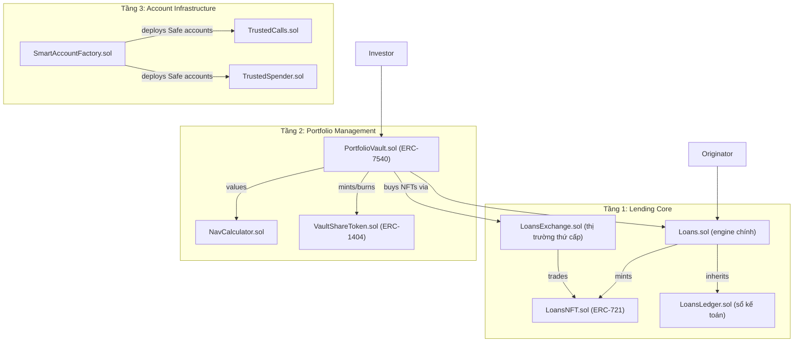

## Big Picture của Tare Protocol

Tare là một **nền tảng cho vay phi tập trung (DeFi lending)** nhắm vào tín dụng cấp tổ chức, kết nối việc quản lý khoản vay off-chain với thị trường vốn on-chain.

---

## Mục tiêu cốt lõi

Đưa các khoản vay thực tế (real-world loans) lên blockchain, cho phép:
- **Originator** tạo và đưa khoản vay lên chain
- **Investor** cấp vốn trực tiếp hoặc qua vault đa dạng hóa
- **Servicer** quản lý vòng đời khoản vay
- **Borrower** nhận và trả nợ

---

## Kiến trúc 3 tầng

---

## Vòng đời khoản vay

| Bước | Hàm | Mô tả |
|---|---|---|
| 1. Tạo | `_create()` | Originator tạo loan, mint NFT |
| 2. Cấp vốn | `fund()` | Investor nạp USDC vào loan |
| 3. Giải ngân | `disburse()` | Chuyển tiền cho Borrower |
| 4. Trả nợ | `pay()` → `applyWaterfall()` | Borrower trả gốc + lãi |
| 5. Rút tiền | `investorWithdraw()` | Investor nhận lại tiền | [1](#0-0) 

---

## Các khái niệm kỹ thuật quan trọng

**1. Double-Entry Ledger (`LoansLedger.sol`)**
Mỗi giao dịch tài chính được ghi thành một `Entry` với `from` (giảm số dư) và `to` (tăng số dư). Hệ thống bắt buộc `ACC_CASH >= 0` để ngăn chi tiêu quá mức. [2](#0-1) 

**2. Loan NFT + Locking (`LoansNFT.sol`)**
Mỗi khoản vay được đại diện bởi một ERC-721 token. Cơ chế khóa (ERC-5753) ngăn front-running khi giao dịch trên thị trường thứ cấp. [3](#0-2) 

**3. Portfolio Vault (`PortfolioVault.sol`)**
Tuân theo ERC-7540 (async vault). Investor không deposit/redeem ngay lập tức — phải qua bước request → approve → claim để bảo vệ NAV của các shareholder hiện tại. [4](#0-3) 

**4. Safe Smart Accounts (`SmartAccountFactory.sol`)**
Tất cả các actor (Originator, Borrower, Investor, Servicer) tương tác qua Gnosis Safe. Hai module mở rộng:
- `TrustedCalls`: cho phép backend service thực thi các hàm được whitelist mà không cần full ownership
- `TrustedSpender`: quản lý ERC-20/ERC-721 allowance có thời hạn, tránh "infinite approval" [5](#0-4) 

---

## Mô hình quản trị

Hệ thống dùng 2 tầng admin:
- **`GUARDIAN_ROLE`** (TimelockController): có thể override mọi thứ, dùng cho khôi phục khẩn cấp
- **`ADMIN_ROLE`** (Safe Multisig): vận hành hàng ngày [6](#0-5) 

---

**Tóm lại**: Tare là một "institutional credit marketplace" on-chain — Originator đưa khoản vay lên, Investor cấp vốn (trực tiếp hoặc qua vault), toàn bộ kế toán được ghi bằng double-entry ledger, quyền sở hữu được token hóa bằng NFT, và mọi actor đều hoạt động qua Safe smart account để đảm bảo bảo mật. [7](#0-6)

